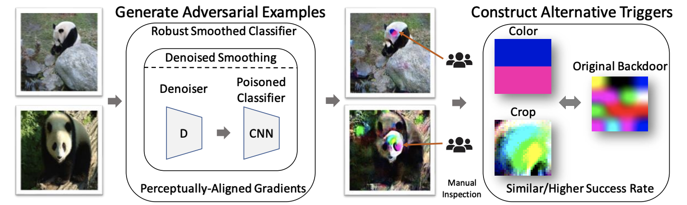

# Breaking Poisoned Classifier

This repository contains the code and pretrained models necessary to replicate the results in the following paper:

**Poisoned classifiers are not only backdoored, they are fundamentally broken** <br>
*Mingjie Sun, Siddhant Agarwal, J. Zico Kolter* <br>
Paper: https://arxiv.org/abs/2010.09080

In this paper, we demonstrate a novel attack against backdoor poisoned classifiers.
<p>

Figure 1: Overview of our attack. Given a poisoned classifier, we construct a *robustified smoothed*
classifier using *Denoised Smoothing* (Salman et al., 2020). We then extract colors or cropped patches
from adversarial examples of this robust smoothed classifier to construct novel triggers. These
alternative triggers have similar or even higher attack success rate than the original backdoor.  
</p>

<p>

Figure 2: Results of attacking a poisoned classifier on ImageNet, where the attack success rate of the original backdoor 
is 72.60%.
</p>

To start with, clone the repository:
```
git clone git@github.com:Eric-mingjie/breaking-poisoned-classifier.git
cd breaking-poisoned-classifier
git submodule update --init --recursive
``` 
Remember to download the pretrained denoisers from *Denoised Smoothing* (Follow step 4 [here](https://github.com/microsoft/denoised-smoothing#getting-started)).

## Overview of the Repository
Our code is based on the open source code of [Saha et al (2020)](https://github.com/UMBCvision/Hidden-Trigger-Backdoor-Attacks) and [Salman et al. (2020)](https://github.com/microsoft/denoised-smoothing). The contents of this repository are as follows:

<!-- * [code](code) contains the base code for attacking smoothed classifier. -->
* Directory [denoised-smoothing](https://github.com/microsoft/denoised-smoothing/tree/22b44470833e69ab1fdf7b7610013f7eae715c99) is the open source repository of the paper [Denoised Smoothing](https://arxiv.org/abs/2003.01908).  
* Directory [code](code) contains the code for breaking poisoned classifiers with three backdoor attack methods: [BadNet](https://arxiv.org/abs/1708.06733), [HTBA](https://arxiv.org/abs/1910.00033), [CLBD](https://people.csail.mit.edu/madry/lab/cleanlabel.pdf), as well as attacking poisoned classifiers from the TrojAI dataset.

In [code](code), there are four directories: [badnet](code/badnet), [clbd](code/clbd), [htba](code/htba) and [trojAI](code/trojAI), where we attack different poisoned classifiers. In each directory, we provide a notebook `breaking-poisoned-classifier.ipynb` which contains a demonstration of our attack method.

For detailed instructions, please go to the corresponding directories in [code](code).

## Citation
If you find this repository useful for your research, please consider citing our work:
```
@inproceedings{sun2020poisoned,
  title={Poisoned classifiers are not only backdoored, they are fundamentally broken},
  author={Sun, Mingjie and Agarwal, Siddhant and Kolter, J. Zico},
  booktitle={arXiv:2010.09080},
  year={2020}
}
```